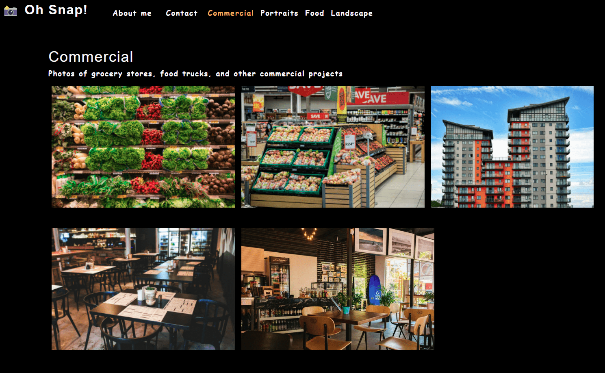

# React Photo Portfolio

 

## **Link** to GitHub repo: https://github.com/alinz07/photo-port

## **Link** to app deployed to GitHub Pages: https://alinz07.github.io/photo-port/

 

## **Motivation**

Create a photographer's portfolio, using React to maximize performance for scalability and benefit from reusable UI components.

 

## **Table of Contents**

[How and Why?](#what-problem-does-this-solve-and-how-was-a-solution-accomplished)  
[Things I learned](#things-i-learned)  
[What makes this project stand out?](#what-makes-this-project-stand-out)  
[Challenge Criteria](#challenge-criteria) 
[Screenshot of Web Application](#screenshot-of-web-application) 
[Credits](#credits) 

 

## **What Problem does this solve and how was a solution accomplished?**

A portfolio with React helps set you apart from other developers who shy away from the latest technologies. A Single Page Application build with React is a great place for me to share my projects with propspective employers and fellow developers, with whom I can collaborate on current/future projects.

 

## **Things I learned**

-   How to conditionally render a component and manage state between the parent and child components.
-   Use hooks to toggle a modal.
-   How to deploy applications to Github Pages.

 

## **What makes this project stand out?**

-   The content rendering and use of state variables make this app impressive to me. I really like simple file structure and minimal code to dynamically render content.

 

## **Challenge Criteria**

AS AN employer looking for candidates with experience building single-page applications
I WANT to view a potential employee's deployed React portfolio of work samples
SO THAT I can assess whether they're a good candidate for an open position

GIVEN a single-page application portfolio for a web developer 

-   Build a single-page application with React 

-   Create reusable components within a React application 

-   Manage state within React components 

-   Pass props to child components 

-   Use React Hooks to manage state in functional components 

-   Conditionally render components based on updates to state 

 

## **Screenshot of Web Application**

 

### **Credits**

Starter code provided by the University of Wisconsin-Milkwaukee Extended Campus Full Stack Coding Bootcamp
